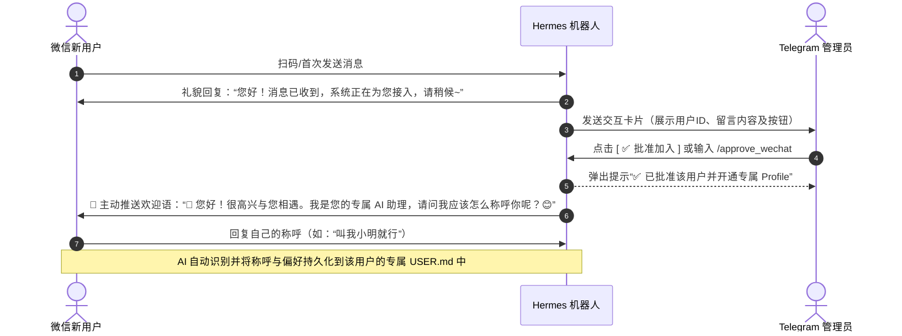

<div align="center">
  <h1>🤖 Hermes Weixin Multi</h1>
  <p><strong>多账号微信接入 & 独立用户记忆与审批插件 · Multi-Account WeChat Plugin for Hermes Agent</strong></p>
  <p>基于腾讯 iLink Bot API，让你的 Hermes Agent 同时接入 <b>无限个微信账号</b>，并为每个微信用户提供<b>完全独立的专属 Profile 与长期记忆隔离</b>。<br>
  <em>Connect unlimited WeChat accounts to Hermes Agent with per-user isolated profiles, interactive Telegram admin approval, and proactive welcome greetings.</em></p>
</div>

<p align="center">
  
  
  
</p>

---

## ✨ 特性 / Features

| 功能 | 官方 `weixin` | 本插件 `weixin_multi` |
|------|:------------:|:-------------------:|
| 多账号支持 / Multi-account | ❌ 单账号 | ✅ 无限账号，动态添加 |
| QR 扫码登录 / QR Login | ❌ CLI 本地 | ✅ 任何渠道（微信/Telegram/WebUI/CLI） |
| 独立 Profile 与记忆物理隔离 | ❌ 全局共享记忆 | ✅ **每个用户自动开通专属 Profile 与独立记忆** |
| Telegram 管理员审批 | ❌ 仅配对码/白名单 | ✅ **Telegram 交互式按钮卡片直接批准/拒绝** |
| 主动欢迎引导语 | ❌ 被动应答 | ✅ **批准后主动推送欢迎语，引导用户介绍称呼** |
| 用户主动注销清空数据 | ❌ 无 | ✅ **发送 `/unregister` 或 `注销账号` 物理删除数据** |
| 扫码自动重试 / Auto Retry | ❌ 过期需重发 | ✅ 自动刷新 3 次 |
| 全局管理命令 / Commands | ❌ | ✅ `/wechat-login`、`/wechat-list`、`/approve_wechat`、`/wechat-users` |
| 消息收发 / Media Support | 基础文本 | ✅ 文本/图片/视频/文件/语音 |
| WebUI 状态 / Status Display | ❌ | ✅ 账号在线状态 |
| 独立轮询 / Independent Polling | ❌ 单线程 | ✅ 每账号独立线程 |

---

## 🔒 独立用户画像与审批工作流



---

## 📦 安装 / Install

### 前置条件 / Prerequisites

- 已安装 [Hermes Agent](https://hermes-agent.nousresearch.com)
- Python 依赖：`aiohttp`、`cryptography`、`qrcode[pil]`、`requests`

```bash
pip install aiohttp cryptography 'qrcode[pil]' requests
```
> ⚠️ Linux/macOS 必须加引号 `'qrcode[pil]'`，Windows 不需要。

### 1. 克隆插件 / Clone Plugin

```bash
git clone https://github.com/sunnylqm/hermes-weixin-multi.git ~/.hermes/plugins/weixin-multi
```

### 2. 启用插件 / Enable Plugin

在 `~/.hermes/config.yaml` 中添加：

```yaml
plugins:
  enabled:
    - weixin-multi

gateway:
  multiplex_profiles: true
  platforms:
    weixin_multi:
      enabled: true
      extra:
        dm_policy: open
        allow_all_users: true
```

重启 Gateway：
```bash
hermes gateway restart
```

---

## 💬 管理员与用户指令

### Telegram 管理员指令

| 指令 | 说明 | 示例 |
|------|------|------|
| `/approve_wechat <配对码或用户ID>` | 批准微信用户加入，并自动创建专属独立 Profile | `/approve_wechat 123456` |
| `/wechat-users` 或 `/wechat_users` | 查看当前已批准用户白名单及待审批列表 | `/wechat-users` |
| `/reject_wechat <配对码或用户ID>` | 拒绝申请或撤销已有用户授权 | `/reject_wechat 123456` |
| `/wechat-list` | 查看所有已连接的微信机器人账号状态 | `/wechat-list` |
| `/wechat-login` | 生成二维码扫码添加新微信号 | `/wechat-login` |

### 微信用户指令

| 指令 / 关键字 | 说明 |
|------|------|
| `/unregister`、`/delete-account`、`注销账号`、`清除我的数据` | **主动注销并物理删除**用户的专属 Profile 目录、所有对话历史与长期记忆 |

---

## 🏗️ 架构与数据隔离 / Architecture

```
Gateway (单进程)
├── wechat-1 ── iLink API ── 📱 微信号 A
└── wechat-2 ── iLink API ── 📱 微信号 B

用户数据存储 (物理隔离)
├── ~/.hermes/profiles/wx_<用户A>/ ── 独立 USER.md / MEMORY.md / sessions / state.db
└── ~/.hermes/profiles/wx_<用户B>/ ── 独立 USER.md / MEMORY.md / sessions / state.db
```

- ✅ **每个微信用户拥有独立的专属 Profile 目录**
- ✅ **用户间的个人画像（`USER.md`）与长期记忆（`MEMORY.md`）物理隔离，绝不串味**
- ✅ **支持 Telegram 实时卡片审批与一键批准**
- ✅ **用户随时可发送 `注销` 彻底物理销毁自身数据**

---

## ⚙️ 配置与存储路径 / Configuration

- **已授权白名单**：`~/.hermes/weixin/approved_users.json`
- **待审批申请列表**：`~/.hermes/weixin/pending_requests.json`
- **微信账号凭证**：`~/.hermes/weixin/accounts/*.json`
- **用户独立 Profile**：`~/.hermes/profiles/wx_<user_id>/`

---

## 📄 许可证 / License

本项目基于 [Hermes Agent](https://github.com/nousresearch/hermes-agent) 与 [hyonex/hermes-weixin-multi](https://github.com/hyonex/hermes-weixin-multi) 修改而来。
**许可证：** GNU Affero General Public License v3.0 (AGPL-3.0)
