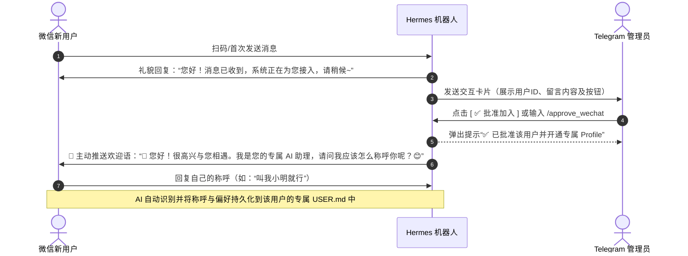

<div align="center">
  <h1>🤖 Hermes Weixin Multi</h1>
  <p><strong>多账号微信接入 & 独立用户记忆与审批插件 · Multi-Account WeChat Plugin for Hermes Agent</strong></p>
  <p>基于腾讯 iLink Bot API，让你的 Hermes Agent 同时接入 <b>无限个微信账号</b>，并为每个微信用户提供<b>完全独立的专属 Profile 与长期记忆隔离</b>。<br>
  <em>Connect unlimited WeChat accounts to Hermes Agent with per-user isolated profiles, interactive Telegram admin approval, and proactive welcome greetings.</em></p>
</div>

<p align="center">
  
  
  
</p>

---

## ✨ 特性 / Features

| 功能 | 官方 `weixin` | 本插件 `weixin_multi` |
|------|:------------:|:-------------------:|
| 多账号支持 / Multi-account | ❌ 单账号 | ✅ 无限账号，动态添加 |
| QR 扫码登录 / QR Login | ❌ CLI 本地 | ✅ Telegram 管理员扫码添加 |
| 管理命令渠道隔离 / Admin channel | ❌ 无 | ✅ **管理命令仅限 Telegram 管理员渠道** |
| 独立 Profile 与记忆物理隔离 | ❌ 全局共享记忆 | ✅ **每个用户自动开通专属 Profile 与独立记忆** |
| Telegram 管理员审批 | ❌ 仅配对码/白名单 | ✅ **Telegram 交互式按钮卡片直接批准/拒绝** |
| 主动欢迎引导语 | ❌ 被动应答 | ✅ **批准后主动推送欢迎语，引导用户介绍称呼** |
| 用户主动注销清空数据 | ❌ 无 | ✅ **发送 `/unregister` 或 `注销账号` 物理删除数据** |
| 扫码自动重试 / Auto Retry | ❌ 过期需重发 | ✅ 自动刷新 3 次 |
| 全局管理命令 / Commands | ❌ | ✅ `/wechat-login`、`/wechat-list`、`/approve_wechat`、`/wechat-users` |
| 消息收发 / Media Support | 基础文本 | ✅ 文本/图片/视频/文件/语音 |
| WebUI 状态 / Status Display | ❌ | ✅ 账号在线状态 |
| 独立轮询 / Independent Polling | ❌ 单线程 | ✅ 每账号独立线程 |

---

## 🔒 独立用户画像与审批工作流



---

## 📦 安装 / Install

### 前置条件 / Prerequisites

- 已安装 [Hermes Agent](https://hermes-agent.nousresearch.com)
- Python 依赖：`aiohttp`、`cryptography`、`qrcode[pil]`、`requests`

```bash
pip install aiohttp cryptography 'qrcode[pil]' requests
```
> ⚠️ Linux/macOS 必须加引号 `'qrcode[pil]'`，Windows 不需要。

### 1. 克隆插件 / Clone Plugin

```bash
git clone https://github.com/sunnylqm/hermes-weixin-multi.git ~/.hermes/plugins/weixin-multi
```

### 2. 启用插件 / Enable Plugin

在 `~/.hermes/config.yaml` 中添加：

```yaml
plugins:
  enabled:
    - weixin-multi

gateway:
  multiplex_profiles: true
  platforms:
    weixin_multi:
      enabled: true
      extra:
        dm_policy: open
        allow_all_users: true
```

并在 `~/.hermes/.env` 中加入:

```
WEIXIN_MULTI_ALLOW_ALL_USERS=true
```

> ⚠️ **不加这一条,审批会"批准成功但用户依然被拦"**。
>
> 网关**刻意不信任** `dm_policy: open` —— 即使适配器声明了 `enforces_own_access_policy`
> (历史上把 "open" 当作授权造成过 fail-open,见核心 `authz_mixin.py` 注释)。于是被插件
> 批准过的用户仍会落进网关**自己的** pairing 流程,收到一句要"配对码"的提示 —— 那是网关的
> 配对码,和插件的配对码是两套东西,看起来就像审批没生效。
>
> 本插件已把 `WEIXIN_MULTI_ALLOW_ALL_USERS` / `WEIXIN_MULTI_ALLOWED_USERS` 注册进平台注册表,
> 所以这个开关只放开 weixin_multi 一个平台。**不要用 `GATEWAY_ALLOW_ALL_USERS=true` 代替** ——
> 那会同时放开 Telegram、Discord 等所有平台。
>
> 放开的只是"网关层不再另行拦截",真正的准入仍由本插件的审批白名单决定。

重启 Gateway：
```bash
hermes gateway restart
```

---

## 💬 管理员与用户指令

### Telegram 管理员指令

> 🔒 **以下命令只能在 Telegram 管理员渠道执行。** 从微信渠道发送会被直接拒绝；
> 从 WebUI / CLI 等无法验证来源的渠道调用时，结果（二维码、用户 ID、配对码）
> 只会推送到 Telegram 管理员会话，调用方本身拿不到任何敏感信息。

| 指令 | 说明 | 示例 |
|------|------|------|
| `/approve_wechat <配对码>` | 批准微信用户加入，并自动创建专属独立 Profile | `/approve_wechat a3f9c1d2` |
| `/wechat-users` 或 `/wechat_users` | 查看当前已批准用户白名单及待审批列表 | `/wechat-users` |
| `/reject_wechat <配对码或用户ID>` | 拒绝申请或撤销已有用户授权 | `/reject_wechat a3f9c1d2` |
| `/wechat-list` | 查看所有已连接的微信机器人账号状态（含在线/掉线） | `/wechat-list` |
| `/wechat-login` | 生成二维码扫码添加新微信号 | `/wechat-login` |
| `/wechat-model [模型ID]` | 查看各 Profile 当前模型；带参数则为**所有微信用户统一切换** | `/wechat-model claude-opus-5` |

配对码是**高熵一次性凭据**，仅通过 Telegram 审批卡片下发。已验证身份的 Telegram
管理员可直接用用户 ID 批准/撤销；其他来源必须出示配对码。

### 微信用户指令

| 指令 / 关键字 | 说明 |
|------|------|
| `/status` | 查看当前模型与会话信息（**只读**） |
| `/unregister`、`/delete-account`、`注销账号`、`清除我的数据` | **主动注销并物理删除**用户的专属 Profile 目录、所有对话历史与长期记忆 |

---

## 🧠 模型统一管控 / Uniform Model Control

**微信用户可看不可改**：`/status` 照常显示当前模型，但 `/model`、`/fast`、`/reasoning`
会被适配器在入站阶段拒绝并提示改用 `/status`。模型只能由 Telegram 管理员通过
`/wechat-model <模型ID>` 更改，且一次对所有人生效。

之所以需要这样做：Hermes 的 `load_config()` 从 **profile 作用域**的 `HERMES_HOME` 读
`config.yaml`，profile 配置是**整体替换** default 而非合并 —— 没有继承。每个微信用户
一个 profile，就意味着一份独立的模型配置副本。而内置 `/model` 是「会话级；`--global`
持久化」，用户可以自行改掉自己那份。

### 推荐：用 managed scope 而不是逐 profile 下发

Hermes 的配置合并是三层，**没有"读取 default profile"这一层**：

```
DEFAULT_CONFIG  →  该 profile 自己的 config.yaml  →  managed scope
```

所以 profile 里**不能**把 `model` 置空来继承全局 —— `DEFAULT_CONFIG["model"]` 是空字符串，
省略只会得到"没有模型"。

但 managed scope(`$HERMES_MANAGED_DIR`，否则 `/etc/hermes/config.yaml`)合并在**最后**，
它 pin 的值**覆盖每一个 profile**。把模型放这里有两个好处：

- 一个文件对所有 profile 生效，无需下发、不会漂移，新建 profile 自动继承
- 它同样覆盖用户用 `/model --global` 写进自己 profile 的值 —— "只有管理员能改模型"
  从**拦命令**升级为**配置解析层面的性质**

检测到可写的 managed scope 时，`/wechat-model` 会直接写它；否则回落到逐 profile 下发。

> 权限取舍：`/etc/hermes` 归 root 时最安全，但网关（非 root）就改不了，`/wechat-model` 会失效。
> 若希望管理员仍能在 Telegram 改模型，把该目录属主给运行网关的用户即可。

逐 profile 下发（无 managed scope 时）的同步范围：

| 同步 | 不同步 |
|---|---|
| `model`（含 `default` / `provider`） | `gateway.platforms`、任何凭据 |
| `fallback_providers`、`custom_providers` | 记忆、会话、`USER.md` |
| `auxiliary.*.model`、`delegation.model` | 其它一切无关配置 |
| `agent.reasoning_effort` | |

> 只带模型 ID 无法运行 —— 它要靠 provider 条目解析，所以 provider 配置随行。
> 每次改动前会把涉及的 config.yaml 备份到 `~/.hermes/weixin/model-sync-<时间戳>/`。
>
> ⚠️ 切换在用户**下一轮对话**生效。若某个会话此前被 `/model` 临时覆盖过（会话级覆盖
> 存在网关的 `_session_model_overrides` 里），该会话需 `/new` 重开才会跟随。

---

## 🏗️ 架构与数据隔离 / Architecture

```
Gateway (单进程)
├── wechat-1 ── iLink API ── 📱 微信号 A
└── wechat-2 ── iLink API ── 📱 微信号 B

用户数据存储 (物理隔离)
├── ~/.hermes/profiles/wx_<sha256(用户A)[:16]>/ ── 独立 USER.md / MEMORY.md / sessions / state.db
└── ~/.hermes/profiles/wx_<sha256(用户B)[:16]>/ ── 独立 USER.md / MEMORY.md / sessions / state.db
```

新用户的 Profile 目录名取微信用户 ID 的 SHA-256 前 16 位。早期版本使用「小写化 +
非字母数字转 `_` + 截断 26 字符」的命名，而微信 openid 长 28 字符且**大小写敏感**,
不同用户可能落到同一目录、共用 `USER.md` 与 `MEMORY.md`。哈希命名消除了这一碰撞。

> 🔄 **老用户原地保留，不改名**：已有老目录的用户继续沿用原目录名，映射记录在
> `~/.hermes/weixin/profile_map.json`。**刻意不做重命名** —— Profile 名同时嵌在网关的
> 会话键（`agent:<profile>:weixin_multi:dm:<user>`）和持久化状态里，改名会让这些引用
> 指向一个不存在的名字，导致会话记录分裂、并让宿主在旧名下重新长出一个空目录。
>
> 一个老目录只会被**一个**用户认领。若两个用户此前正共用同一目录（说明碰撞已经发生），
> 先到者保留该目录，后到者获得全新的哈希 Profile —— 不会把别人的数据继续带下去。

- ✅ **每个微信用户拥有独立的专属 Profile 目录**
- ✅ **用户间的个人画像（`USER.md`）与长期记忆（`MEMORY.md`）物理隔离，绝不串味**
- ✅ **支持 Telegram 实时卡片审批与一键批准**
- ✅ **用户随时可发送 `注销` 彻底物理销毁自身数据**

---

## 🔐 管理权限 / Admin Access Control

管理命令的唯一合法入口是 **Telegram 管理员渠道**，由 `TELEGRAM_BOT_TOKEN` +
`TELEGRAM_HOME_CHANNEL`（或 `TELEGRAM_ALLOWED_USERS`）确定管理员身份。三层判定：

| 调用来源 | 行为 |
|---|---|
| Telegram 管理员会话 | ✅ 完整权限，结果内联返回 |
| 微信渠道 | ❌ 在适配器入站阶段直接拒绝，命令不会到达处理器 |
| WebUI / CLI / Agent 工具（来源不可验证） | ⚠️ 受限：敏感结果只推送到 Telegram 管理员会话；批准/撤销必须出示配对码 |

**未配置 Telegram 时，所有管理命令一律禁用**（fail closed）。

| 环境变量 | 默认 | 说明 |
|---|---|---|
| `WEIXIN_ADMIN_CHANNEL` | `telegram` | 管理渠道。设为 `any` 可关闭该限制（**不推荐**，会恢复任意渠道可执行管理命令的旧行为） |
| `WEIXIN_DEFAULT_APPROVED` | 空 | 逗号分隔的预批准微信用户 ID。**默认为空**；此处配置的 ID 会在每次启动时重新写回白名单，因而无法通过 `/reject_wechat` 撤销 |

### Telegram 审批按钮（需要宿主侧一段转发代码）

审批卡片上的 **[✅ 批准加入] / [❌ 拒绝]** 按钮依赖 Telegram 的 `callback_query`。
Hermes 的插件 API 目前没有暴露 Telegram 回调注册点（只有 `register_slack_action_handler`），
因此需要在宿主的 Telegram 适配器 `_handle_callback_query()` 里加一段**转发**代码。

鉴权与所有状态变更都在本插件的 `auth_manager.handle_telegram_callback()` 内完成，
宿主侧只负责转发，因此这段代码在 Hermes 升级被覆盖后重新贴一次即可，无需重新实现安全逻辑：

```python
# --- WeChat Multi-account user approval callbacks (wx:appr / wx:deny) ---
# Thin dispatch only: authorization and every state change live in the
# weixin-multi plugin's auth_manager, so they survive host upgrades.
if data.startswith("wx:"):
    try:
        import os as _os
        import sys as _sys

        _wx_dir = _os.path.join(
            _os.environ.get("HERMES_HOME", _os.path.expanduser("~/.hermes")),
            "plugins",
            "weixin-multi",
        )
        if _wx_dir not in _sys.path:
            _sys.path.insert(0, _wx_dir)
        import auth_manager

        result = auth_manager.handle_telegram_callback(
            data, clicker_id=str(getattr(query.from_user, "id", ""))
        )
        await query.answer(text=result.get("answer") or "")
        note = result.get("note")
        if note:
            try:
                await query.edit_message_text(
                    text=(query.message.text or "") + note,
                    parse_mode=ParseMode.HTML,
                    reply_markup=None,
                )
            except Exception:
                pass
    except Exception as exc:
        logger.error("Failed to handle weixin approval callback: %s", exc)
        await query.answer(text=f"操作异常: {exc}")
    return
```

> ⚠️ **不要**在宿主侧直接调用 `approve_user_request()` / `reject_user_request()`。
> 那样会跳过点击者身份校验 —— 卡片若出现在群里，任何成员都能点“批准”。
> `handle_telegram_callback()` 会先用 `TELEGRAM_ALLOWED_USERS` 校验点击者，
> 未配置管理员时一律拒绝（fail closed）。

不贴这段也不影响使用：管理员照常可以在 Telegram 输入 `/approve_wechat <配对码>`。

---

## ⚙️ 配置与存储路径 / Configuration

- **已授权白名单**：`~/.hermes/weixin/approved_users.json`
- **待审批申请列表**：`~/.hermes/weixin/pending_requests.json`
- **微信账号凭证**：`~/.hermes/weixin/accounts/*.json`（权限 `0600`）
- **用户 Profile 映射**：`~/.hermes/weixin/profile_map.json`
- **用户独立 Profile**：`~/.hermes/profiles/wx_<sha256(user_id)[:16]>/`

---

## 📄 许可证 / License

本项目基于 [Hermes Agent](https://github.com/nousresearch/hermes-agent) 与 [hyonex/hermes-weixin-multi](https://github.com/hyonex/hermes-weixin-multi) 修改而来。
**许可证：** GNU Affero General Public License v3.0 (AGPL-3.0)
